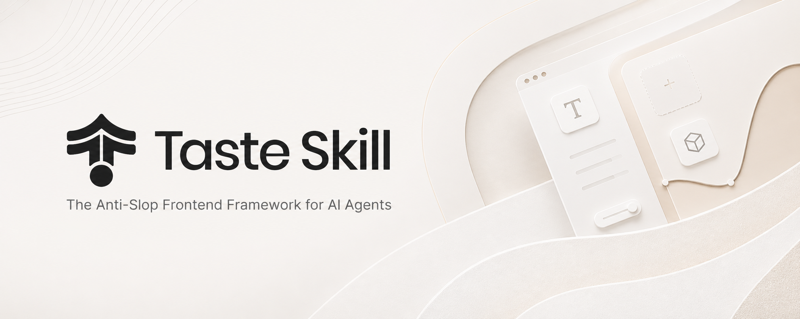
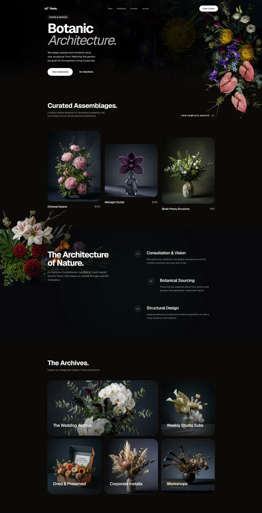
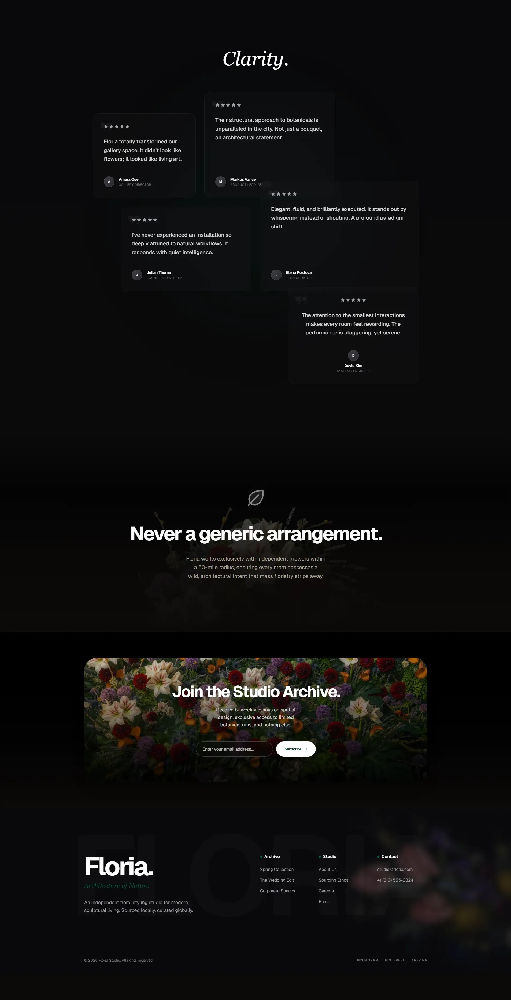

<p align="center">
  
</p>

# Chason Design

<p align="center">
  <em>The Anti-Slop Frontend Framework for AI Agents</em>
</p>

<p align="center">
  <sub>Created by bitan</sub>
</p>

<p align="center">
  <a href="https://github.com/bitan-del/chason-design" title="Chason Design">
    
  </a>
</p>

Portable **Agent Skills** that upgrade AI-built interfaces: stronger layout, typography, motion, and spacing instead of boilerplate-looking UIs. This repo also includes **image-generation skills** for reference boards (web, mobile, brand kits). Pair them with **ChatGPT Images** or similar generators, then hand the frames to Codex, Cursor, or Claude Code for implementation.

<p align="center">
<a href="https://github.com/bitan-del/chason-design/stargazers"></a>
<a href="LICENSE"></a>
<a href="#installing"></a>
<a href="CHANGELOG.md"></a>
</p>

## Disclaimer

Chason Design has no official token, coin, or crypto project. Any token using my name, image, or project is unaffiliated and not endorsed by me.

<p align="center"><sub><a href="#disclaimer">Disclaimer</a> · <a href="#installing">Install</a> · <a href="#skills">Skills</a> · <a href="#settings-chason-design-only">Settings</a> · <a href="#examples">Examples</a> · <a href="#support-the-project">Sponsor</a> · <a href="#research">Research</a> · <a href="#common-questions">FAQ</a> · <a href="#license">License</a></sub></p>

## Feedback & Contributions

We would love your feedback. Suggestions and bug reports:

- Open a Pull Request or Issue on [GitHub](https://github.com/bitan-del/chason-design/issues)

## Installing

The [`npx skills add`](https://github.com/vercel-labs/agent-skills) CLI scans the `skills/` folder in this repo, so **all skills below (code and image-generation) install the same way.**

```bash
npx skills add https://github.com/bitan-del/chason-design
```

Install a single skill by its **install name** (the `name:` field inside the SKILL frontmatter, not the folder name):

```bash
npx skills add https://github.com/bitan-del/chason-design --skill "chason-design"
```

You can also copy any `SKILL.md` into your project or paste it into ChatGPT / Codex conversations.

### Updating from the previous version

The default `chason-design` (install name `chason-design`) is now **v2 (experimental)**, a substantial rewrite of the original v1. If you already have v1 installed, just re-run the install command and you will be upgraded:

```bash
npx skills add https://github.com/bitan-del/chason-design --skill "chason-design"
```

The install name did not change, so no script updates are needed. The newer SKILL.md replaces the older one in place.

If you depend on the exact behavior of v1 and want to pin to it explicitly:

```bash
npx skills add https://github.com/bitan-del/chason-design --skill "chason-design-v1"
```

See [CHANGELOG.md](CHANGELOG.md) for the full v1 to v2 diff and the rationale.

## Skills

Each skill does one job; you do not need all of them at once. **Implementation skills** output code. **Image-generation skills** output reference images only.

The `Install name` column is the exact value you pass to `--skill`.

| Skill (folder) | Install name | Description |
| --- | --- | --- |
| **chason-design** | `chason-design` | 🆕 **v2 (experimental)** - substantial rewrite of the default skill. Reads the brief, infers the design language, tunes three dials (VARIANCE / MOTION / DENSITY). Brief inference, design-system map, hard em-dash ban, canonical GSAP code skeletons, redesign-audit protocol, strict pre-flight check. Actively iterating toward v2.0.0 stable. |
| **chason-design-v1** | `chason-design-v1` | The original v1 of Chason Design, preserved for projects depending on its exact behavior. Use only if the v2 default breaks something specific in your workflow. |
| **gpt-tasteskill** | `gpt-taste` | Stricter variant for GPT/Codex: higher layout variance, stronger GSAP direction, aggressive anti-slop. |
| **image-to-code-skill** | `image-to-code` | Image-first pipeline: generate site references, analyze them, then implement the frontend to match. |
| **redesign-skill** | `redesign-existing-projects` | Existing projects: audit the UI first, then fix layout, spacing, hierarchy, styling. |
| **soft-skill** | `high-end-visual-design` | Polished, calm, expensive UI with softer contrast, whitespace, premium fonts, spring motion. |
| **output-skill** | `full-output-enforcement` | When the model ships half-finished work: full output, no placeholder comments. |
| **minimalist-skill** | `minimalist-ui` | Editorial product UI (Notion/Linear vibes), restrained palette, crisp structure. |
| **brutalist-skill** | `industrial-brutalist-ui` | Hard mechanical language: Swiss type, sharp contrast, experimental layout. |
| **stitch-skill** | `stitch-design-taste` | Google Stitch-compatible rules, including optional `DESIGN.md` export format. |

### Image generation skills

These produce design images only (no code). Use with ChatGPT Images, Codex image mode, or any agent that generates images.

| Skill (folder) | Install name | Description |
| --- | --- | --- |
| **imagegen-frontend-web** | `imagegen-frontend-web` | Website comps: hero, landing, multi-section with strong typography, spacing, anti-slop art direction. |
| **imagegen-frontend-mobile** | `imagegen-frontend-mobile` | Mobile screens and flows: iOS/Android/cross-platform, mockups, readable type, coherent sets. |
| **brandkit** | `brandkit` | Brand-kit boards: logo directions, palettes, type, identity applications across categories. |

### Which one should I use?

- Start with **chason-design** for the safest general default. (Now v2 experimental - see what changed in the [CHANGELOG](CHANGELOG.md).)
- If you depend on the exact behavior of the original Chason Design, install **chason-design-v1** instead. 
- Use **gpt-taste** when you want the stricter GPT/Codex-oriented rules and motion/layout enforcement. 
- Use **image-to-code-skill** for image → analyze → code website workflows. 
- Use **redesign-skill** to improve an existing codebase instead of greenfield styling. 
- Add **soft-skill**, **minimalist-skill**, or **brutalist-skill** when the visual direction is already chosen. 
- Add **output-skill** if the agent keeps truncating output. 
- Use **imagegen-frontend-web**, **imagegen-frontend-mobile**, or **brandkit** when the deliverable is **images** (comps, flows, identity boards), then pass results to your coding agent.

### Image-first tip

For **image-to-code-skill**, state the pipeline in the prompt, e.g.: `follow the skill: generate images, then analyze, then code`.

### ChatGPT Images and Codex

Attach or paste **`imagegen-frontend-web`**, **`imagegen-frontend-mobile`**, or **`brandkit`** and ask for the frames you need, then feed the renders to Codex, Cursor, or Claude Code. Use **image-to-code-skill** when you want one workflow that both generates references and implements the site in code.

## Settings (chason-design only)

Numbers at the top of the file are 1-10 dials:

- **DESIGN_VARIANCE**: Layout experimentation (lower: centered/clean · higher: asymmetric/modern).
- **MOTION_INTENSITY**: Animation depth (lower: hover · higher: scroll/magnetic).
- **VISUAL_DENSITY**: Information per viewport (lower: spacious · higher: dense dashboards).

## Examples

Created with Chason Design:

<p>
  
  
</p>

## Support the project

If Chason Design helps you, consider sponsoring:

[Sponsor on GitHub](https://github.com/sponsors/bitan-del)

<p align="center">
 <a href="https://www.star-history.com/#bitan-del/chason-design&Date">
  <picture>
   <source media="(prefers-color-scheme: dark)" srcset="https://api.star-history.com/badge?repo=bitan-del/chason-design&theme=dark" />
   <source media="(prefers-color-scheme: light)" srcset="https://api.star-history.com/badge?repo=bitan-del/chason-design" />
   
  </picture>
 </a>
</p>

## Research

Background writing that shaped these skills lives in [`research/`](research/).

## Common Questions

**How is this different from other AI design skills?**  
Multiple specialized variants, adjustable dials in key skills, anti-repetition rules informed by dedicated research. All are framework agnostic across major coding agents.

**Does it work with React, Vue, Svelte?**  
Yes. Rules target design intent, not a single framework API.

**What is SKILL.md?**  
A portable instruction file agents can load automatically; install via `npx skills add` or by copying into a repo or conversation.

**Do image-generation skills install with `npx skills add`?**  
Yes. They live under `skills/` alongside the code skills so the same CLI discovers them.

## License

[MIT License](LICENSE) · Copyright (c) 2026 bitan
